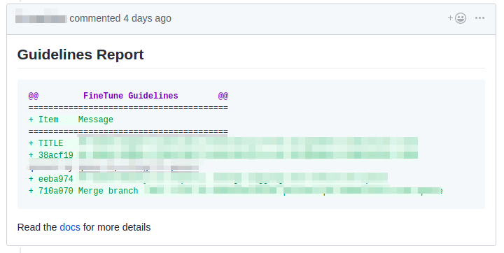
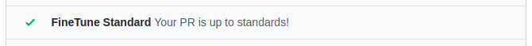
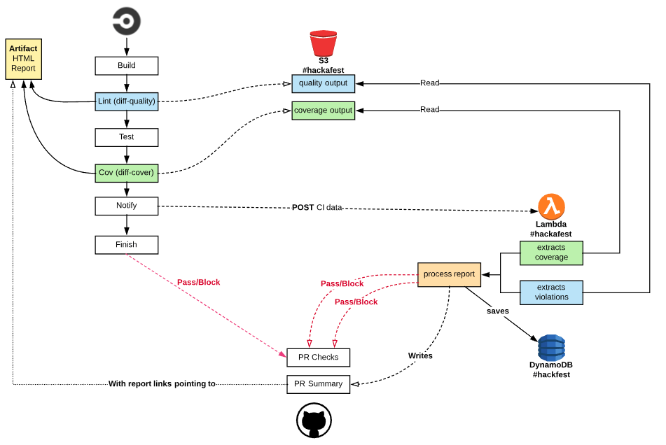
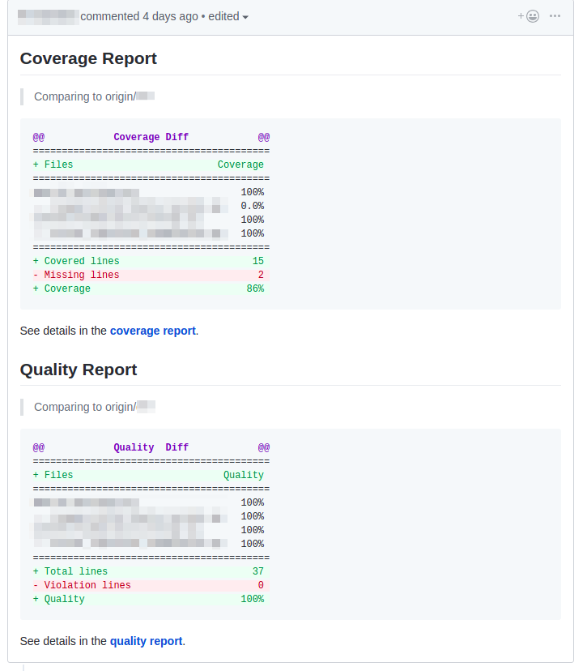
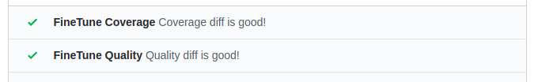

# Lambda PR Checks

[FineTune](https://www.finetunelearning.com/) will be holding a development **hackfest** during the month of December/2018 where anybody in the company is welcome to participate. Challenge's goal is to bring some new idea that might benefit the company.

This hackfest project brings a collection of PR checks to be run inside AWS lambda, all of them has the same purpose: **A better assessment and review of Pull Requests**.

## Summary

- Checks
    - [Pull Request Standards](#Pull-Request-Standards)
    - [Code Freeze](#Code-Freeze)
    - [Coverage and Quality](#Coverage-and-Quality)
- [Building & Testing](#Building--Testing)
- [Environment Variables](#Environment-Variables)
- [Packaging and deployment](#Packaging-and-deployment)
- [Bringing to the next level](#Bringing-to-the-next-level)
- [Thanks](#Thanks)


---


# Pull Request Standards

We want to have every Pull Request and commit to follow our guidelines: Tag the ticket in both title and commit, so we can better identify where the tasks were done.

It gives you both a summary report and a PR check as well.

### Result Example

**Summary**



**Check**




# Code Freeze

There are moments where no matter how successful the code/test is, we just don't want to merge new stuff right away, so we can better plan our QA testing or just schedule a proper time for doing it.

Since we use Slack a lot, makes sense to have a quick command for enabling/disabling such moments.

It's possible to use
`/codefreeze status`, `/codefreeze enable`, and `/codefreeze disable` for those.

Doing so will block/pass checks in any open PR.


# Coverage and Quality

It's an integration to validate quality (linters) and tests coverage. It works in two phases:

1. [Generate reports](#Generate-Reports)
2. [Assess reports](#Assess-Reports)

Second step may be triggered in row if a PR is already open when reports are generated.



### Generate Reports

We use CircleCI with [coverage.py](https://github.com/nedbat/coveragepy) to generate a xml report, then we use [diff-cover](https://github.com/Bachmann1234/diff-cover) to generate both coverage and quality reports only for changed lines of code.

HTML reports are saved inside CircleCI as [artifacts](https://circleci.com/docs/2.0/artifacts/) alongside the outputs of such commands.

Those saved outputs are sent to a S3 bucket, to be read/processed in next step. You can see an output example for [coverage](tests/payloads/covdiff.txt) and [quality](tests/payloads/qualitydiff.txt).

Reports are processed and gets saved to DynamoDB for assessing later.

### Assess Reports

When a PR gets updated with new code, reports are retrieven from DynamoDB and gives you a summary report and a PR check as well.

The summary have some links with more details pointing to HTML report stored in CircleCI artifacts.

### Result Example

**Summary**



**Check**



# Building & Testing

It requires:
* [Python 3.7 installed](https://www.python.org/downloads/)
* [Docker installed](https://www.docker.com/community-edition)
* [Python Virtual Environment](http://docs.python-guide.org/en/latest/dev/virtualenvs/) (for unit testing)


## SAM testing

**SAM CLI** is used to emulate both Lambda and API Gateway locally and uses our `template.yaml` to understand how to bootstrap this environment (runtime, where the source code is, etc.).

```bash
export AWS_PROFILE={DESIRED_AWS_ACCOUNT}

sam build

sam local start-api
```

`localhost:3000` will be available for testing your functions

## Unit testing

```bash
# Setup virtualenv
virtualenv -p python3.7 .venv
source .venv/bin/activate

# Install dependencies
pip install -r dev-requirements.txt

# Run it
bin/test
```


# Environment Variables

For correct functionality, it requires a couple environment variables to be set.

| Variable | Description | Function |
|---|---|---|
| **GITHUB_TOKEN** | Token used to update PR status and write comments (aka summaries). Token provided should have permissions for repo and write:discussion. | All |
| **GITHUB_USER** | The username assigned for the GitHubToken user (e.g. guilatrova). It's used to double check when a summary should be whether edited or deleted. | All |
| **DOCS_STANDARD_LINK** | Link to the standards document. It will be added to the Guidelines Report. | Pull Request Standards |
| **BUCKET_NAME** | S3 bucket that will be used to store/read quality/coverage reports | Coverage and Quality |


# Packaging and deployment

AWS Lambda Python runtime requires a flat folder with all dependencies including the application. SAM will use `CodeUri` property to know where to look up for both application and dependencies.

Firstly, we need a `S3 bucket` where we can upload our Lambda functions packaged as ZIP before we deploy anything - If you don't have a S3 bucket to store code artifacts then this is a good time to create one:

```bash
aws s3 mb s3://BUCKET_NAME
```

> Becareful here to avoid messing up the bucket u'sed for storing reports (that uses the BUCKET_NAME variable) with this one used for storing the lambda functions.

## Manual deployment

Next, run the following command to package our Lambda function to S3:

```bash
sam package \
    --output-template-file packaged.yaml \
    --s3-bucket $BUCKET_NAME
```

Next, the following command will create a Cloudformation Stack and deploy your SAM resources.

```bash
sam deploy \
    --template-file packaged.yaml \
    --stack-name $STACK_NAME \
    --capabilities CAPABILITY_IAM
```

> **See [Serverless Application Model (SAM) HOWTO Guide](https://github.com/awslabs/serverless-application-model/blob/master/HOWTO.md) for more details in how to get started.**

## Script deployment

You can use `deploy` script for automating the packaging + deployment with correct environment variables.

```bash
# Format
bin/deploy "stack-name" "lambda-bucket-name" "gh-token" "gh-username" "docs-url" "reports-bucket-name"

# Example
bin/deploy "lambda-pr-checks-stack" "lambda-pr-checks-functions" "123456789" "guilatrova" "www.mycompany.com/git/standards" "ci-quality-reports"
```

# Bringing to the next level

The project would be awesome if we:

- Add `aws` and `thirdparties` as [lambda layers](https://docs.aws.amazon.com/lambda/latest/dg/configuration-layers.html).
- Use quality report information to [request line reviews](https://developer.github.com/v3/pulls/reviews/#example) on GitHub.
- Setup a [GitHub App](https://developer.github.com/apps/) over using a user like we do.

# Thanks

I thank primarily to **God** for such great inspiration and opportunity to showcase a project like that.
I also thank my company, **FineTune** for this great idea on throwing a hackfest challenge and the incentive on doing so.
